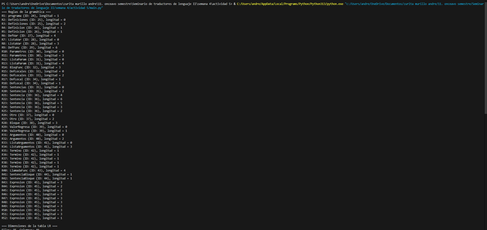
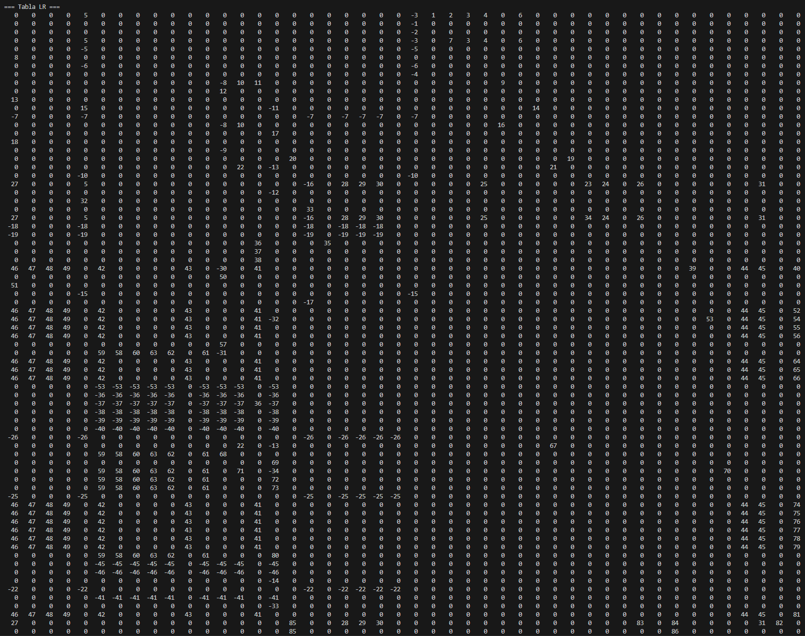
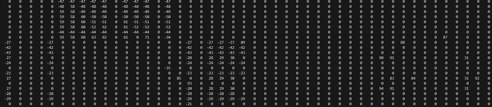
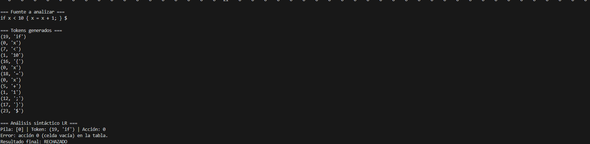

# Analizador Sintáctico LR (Compilador)

Este proyecto integra:
1. Un **analizador léxico** en Python, que clasifica los tokens según el archivo `compilador.inf`.
2. Un **analizador sintáctico LR**, que lee la tabla LR desde un archivo `compilador.lr`.
3. Un **código de ejemplo** (`mian.py`) que tokeniza la entrada, carga la tabla y realiza el análisis sintáctico.

### Archivos principales

- **`compilador.inf`**  
  Contiene la numeración de tokens (por ejemplo, `identificador = 0`, `entero = 1`, `real = 2`, etc.) y la lista de reglas con sus respectivos números. No se lee automáticamente por el programa; sirve de referencia para asignar los valores en el analizador léxico.

- **`compilador.lr`**  
  Archivo de texto que **sí** se lee en tiempo de ejecución. Incluye:
  1. Número de reglas de la gramática.  
  2. Para cada regla: (ID del no terminal, longitud del lado derecho, nombre del no terminal).  
  3. Número de filas y columnas de la tabla LR.  
  4. La **tabla LR** en forma de matriz de enteros.

- **`mian.py`**  
  - **Analizador léxico**: la clase `Lexico` asigna los tokens según `TokenType`.  
  - **Lectura de la tabla**: la función `leer_lr_file` carga `compilador.lr`.  
  - **Parser LR**: la función `parser_lr` implementa el algoritmo LR clásico con una pila de enteros.  
  - **`main()`**: integra todo (carga la tabla, tokeniza la cadena de entrada y realiza el análisis).

**Captura de pantalla**

